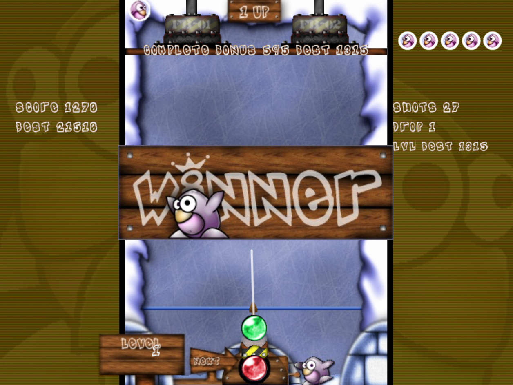

# Frozen Bubble Swift

A native Swift/SpriteKit revival of the classic Frozen Bubble single-player experience for macOS.

This project is a ground-up Swift implementation using the original Frozen Bubble gameplay idea, graphics, sounds, music, and level data. It is intended as a small open-source preservation and nostalgia project.



## Preview

Requirements:

- macOS 13 or newer
- Swift toolchain / Xcode command line tools

Run from the repository root:

```sh
swift run FrozenBubbleSwift
```

Build a preview macOS app package:

```sh
./scripts/package-macos.sh
```

Controls:

- Left / Right: aim
- Space / Up: fire / continue
- Esc: return to menu
- R: restart current level
- N: new run
- Cmd-Q: quit

## Current Features

- 100 original single-player levels
- Original graphics, music, and sound effects
- Optional colorblind bubbles
- Optional rushMe mode
- Local progress and scores in `~/Library/Preferences/de.twocent.frozenbubble.plist`
- Lives, scoring, compressor, win/lose flow, and menu

## Credits

Design & game idea:

- Guillaume Cottenceau

Artwork:

- Alexis Younes
- Amaury Amblard-Ladurantie

Soundtrack:

- Matthias Le Bidan

Swift revival:

- Steffi
- Codex

See [CREDITS.md](CREDITS.md) for more detail.

## License

Frozen Bubble is GPL-2.0. This revival keeps the project GPL-compatible. See [LICENSE](LICENSE) and [CREDITS.md](CREDITS.md).
